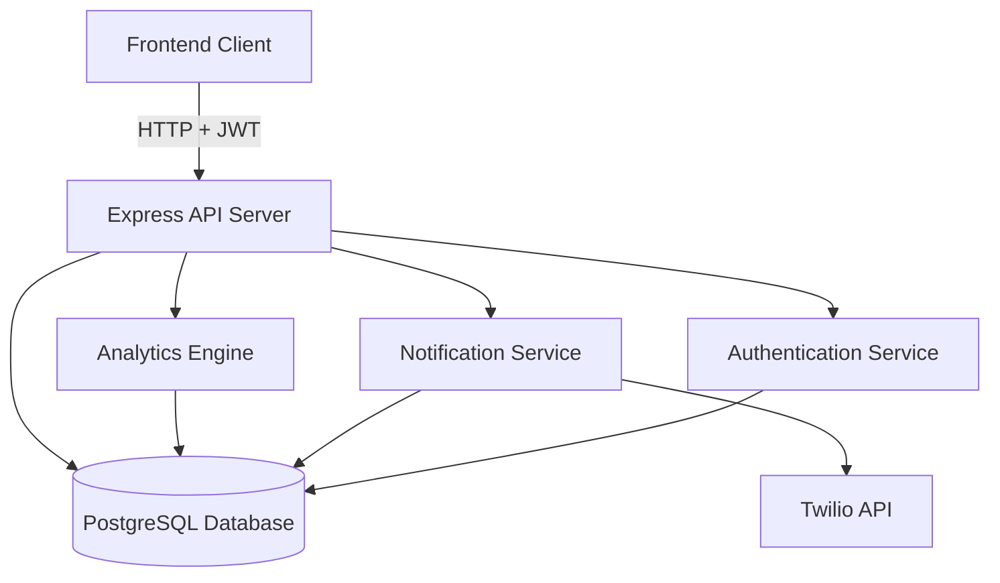

# Design Document: Backend Enhancement

## Overview

This design enhances the Silent Stroke Detector backend from a basic screening storage API to a production-ready medical platform. The system currently provides minimal functionality (screening storage, hospital lookup, health checks) and requires comprehensive additions for authentication, notifications, analytics, advanced querying, testing, and documentation.

### Current System State

The existing backend is a Node.js/Express application with:
- PostgreSQL database with `screenings` and `alert_events` tables
- Basic CRUD operations for screenings
- Static hospital data loaded from JSON file
- Simple health check endpoint
- No authentication or authorization
- No real-time notifications
- No analytics capabilities
- No automated testing
- No API documentation

### Enhancement Goals

Transform the backend into a secure, observable, well-tested medical screening platform with:
- JWT-based authentication and role-based authorization
- Real-time SMS and voice call notifications via Twilio
- Analytics engine for screening trends and risk patterns
- Advanced search and filtering capabilities
- Comprehensive integration test suite
- OpenAPI documentation with Swagger UI
- Production-ready error handling and monitoring
- Database migration management
- Audit logging for compliance

### Key Design Decisions

1. **Authentication Strategy**: JWT tokens with bcrypt password hashing (industry standard for stateless APIs)
2. **Notification Provider**: Twilio (reliable, well-documented, supports both SMS and voice)
3. **Testing Framework**: Jest with Supertest (standard for Node.js API testing)
4. **Documentation**: OpenAPI 3.0 with Swagger UI (interactive, self-documenting)
5. **Migration Tool**: node-pg-migrate (lightweight, PostgreSQL-focused)
6. **Validation Library**: Joi (expressive schema validation for Express)
7. **Rate Limiting**: express-rate-limit (simple, effective)

## Architecture

### System Components



### Layer Architecture

The system follows a layered architecture:

1. **Routes Layer** (`src/routes/`): HTTP request handling, input validation, response formatting
2. **Service Layer** (`src/services/`): Business logic, orchestration, external API calls
3. **Repository Layer** (`src/repositories/`): Database queries, data access abstraction
4. **Middleware Layer** (`src/middleware/`): Authentication, authorization, rate limiting, error handling

### Data Flow

**Screening Creation with Alert**:
```
Client → POST /api/screenings → Validation Middleware → Auth Middleware
→ Screening Route → Screening Service → Screening Repository → Database
→ Notification Service → Twilio API → Alert Event Repository → Database
→ Response to Client
```

**Analytics Query**:
```
Client → GET /api/analytics → Auth Middleware → Authorization Check
→ Analytics Route → Analytics Service → Analytics Repository → Database
→ Aggregate Computation → Response to Client
```

## Components and Interfaces

### Authentication Service

**Responsibilities**:
- User registration and login
- Password hashing with bcrypt (12 rounds minimum)
- JWT token generation and validation
- Token expiration management (24-hour lifetime)

**Interface**:
```javascript
class AuthService {
  async register(username, password, role)
  async login(username, password)
  async verifyToken(token)
  generateToken(userId, username, role)
}
```

**Dependencies**:
- `bcrypt`: Password hashing
- `jsonwebtoken`: JWT generation and verification
- `userRepository`: Database access for user records

### Notification Service

**Responsibilities**:
- Send SMS alerts for high-risk screenings
- Initiate voice calls for critical priority cases
- Handle Twilio API errors gracefully
- Store notification delivery status

**Interface**:
```javascript
class NotificationService {
  async sendSmsAlert(screening, hospital)
  async initiateVoiceCall(screening, hospital)
  async triggerAlertForScreening(screeningId)
}
```

**Twilio Integration**:
- Uses Twilio REST API client
- Requires account SID, auth token, and phone number from environment
- Stores message SID for tracking
- Logs errors without crashing on API failures

### Analytics Engine

**Responsibilities**:
- Compute daily screening counts
- Calculate average risk scores by location
- Compute alert rate percentage
- Identify high-risk locations
- Filter out demo/test data

**Interface**:
```javascript
class AnalyticsService {
  async getDailyScreeningCounts(startDate, endDate)
  async getAverageRiskByLocation(startDate, endDate)
  async getAlertRate(startDate, endDate)
  async getTopRiskLocations(limit, startDate, endDate)
  async getAnalyticsSummary(startDate, endDate)
}
```

**Query Optimization**:
- Uses PostgreSQL aggregate functions (COUNT, AVG, GROUP BY)
- Indexes on `created_at`, `location`, `should_alert` for performance
- Excludes demo data with WHERE clause filter

### Screening Repository (Enhanced)

**New Methods**:
```javascript
class ScreeningRepository {
  // Existing
  async createScreening(screening)
  async listScreenings(limit)
  
  // New
  async getScreeningById(id)
  async getScreeningsByPatient(patientName, limit, offset)
  async searchScreenings(filters, limit, offset)
  async getPatientTrend(patientName)
}
```

**Search Filters**:
- `patientName`: Partial match, case-insensitive (ILIKE)
- `location`: Partial match, case-insensitive (ILIKE)
- `riskScoreMin`, `riskScoreMax`: Numeric range
- `startDate`, `endDate`: Timestamp range
- `shouldAlert`: Boolean filter
- `priority`: Exact match (LOW, MEDIUM, HIGH, CRITICAL)

### Hospital Repository

**Responsibilities**:
- CRUD operations for hospital records
- Search by name or location
- Find nearest hospital by coordinates

**Interface**:
```javascript
class HospitalRepository {
  async createHospital(hospital)
  async updateHospital(id, updates)
  async deleteHospital(id)
  async listHospitals(limit, offset)
  async searchHospitals(query)
  async findNearestHospital(latitude, longitude)
}
```

**Geospatial Query**:
Uses Haversine formula or PostgreSQL PostGIS extension for distance calculation.

### Audit Trail Service

**Responsibilities**:
- Log all create, update, delete operations
- Store user ID, timestamp, operation type, affected resource
- Capture old and new values for updates
- Mask sensitive fields

**Interface**:
```javascript
class AuditService {
  async logOperation(userId, operation, tableName, recordId, oldValues, newValues)
  async getAuditLogs(filters)
}
```

**Storage**:
```sql
CREATE TABLE audit_trail (
  id SERIAL PRIMARY KEY,
  user_id INTEGER REFERENCES users(id),
  operation TEXT NOT NULL, -- 'CREATE', 'UPDATE', 'DELETE'
  table_name TEXT NOT NULL,
  record_id INTEGER NOT NULL,
  old_values JSONB,
  new_values JSONB,
  created_at TIMESTAMPTZ NOT NULL DEFAULT NOW()
);
```

### Middleware Components

**Authentication Middleware**:
```javascript
async function authenticate(req, res, next) {
  // Extract JWT from Authorization header
  // Verify token signature and expiration
  // Attach user info to req.user
  // Call next() or return 401
}
```

**Authorization Middleware**:
```javascript
function authorize(...roles) {
  return (req, res, next) => {
    // Check if req.user.role is in allowed roles
    // Call next() or return 403
  }
}
```

**Validation Middleware**:
```javascript
function validate(schema) {
  return (req, res, next) => {
    // Validate req.body against Joi schema
    // Call next() or return 400 with field errors
  }
}
```

**Rate Limiting Middleware**:
```javascript
const limiter = rateLimit({
  windowMs: 15 * 60 * 1000, // 15 minutes
  max: 100, // 100 requests per window
  message: 'Too many requests, please try again later'
});
```

## Data Models

### Users Table

```sql
CREATE TABLE users (
  id SERIAL PRIMARY KEY,
  username TEXT UNIQUE NOT NULL,
  password_hash TEXT NOT NULL,
  role TEXT NOT NULL CHECK (role IN ('admin', 'viewer')),
  created_at TIMESTAMPTZ NOT NULL DEFAULT NOW(),
  updated_at TIMESTAMPTZ NOT NULL DEFAULT NOW()
);

CREATE INDEX idx_users_username ON users(username);
```

### Hospitals Table

```sql
CREATE TABLE hospitals (
  id SERIAL PRIMARY KEY,
  name TEXT NOT NULL,
  phone TEXT NOT NULL,
  address TEXT NOT NULL,
  latitude NUMERIC(10, 7) NOT NULL,
  longitude NUMERIC(10, 7) NOT NULL,
  capabilities JSONB DEFAULT '[]',
  created_at TIMESTAMPTZ NOT NULL DEFAULT NOW(),
  updated_at TIMESTAMPTZ NOT NULL DEFAULT NOW(),
  UNIQUE(name, latitude, longitude)
);

CREATE INDEX idx_hospitals_location ON hospitals(latitude, longitude);
CREATE INDEX idx_hospitals_name ON hospitals(name);
```

### Enhanced Alert Events Table

```sql
ALTER TABLE alert_events 
ADD COLUMN notification_status TEXT DEFAULT 'pending',
ADD COLUMN twilio_message_sid TEXT,
ADD COLUMN error_message TEXT;
```

### Audit Trail Table

```sql
CREATE TABLE audit_trail (
  id SERIAL PRIMARY KEY,
  user_id INTEGER REFERENCES users(id),
  operation TEXT NOT NULL CHECK (operation IN ('CREATE', 'UPDATE', 'DELETE')),
  table_name TEXT NOT NULL,
  record_id INTEGER NOT NULL,
  old_values JSONB,
  new_values JSONB,
  created_at TIMESTAMPTZ NOT NULL DEFAULT NOW()
);

CREATE INDEX idx_audit_trail_user ON audit_trail(user_id);
CREATE INDEX idx_audit_trail_created_at ON audit_trail(created_at);
CREATE INDEX idx_audit_trail_table ON audit_trail(table_name, record_id);
```

### Schema Migrations Table

```sql
CREATE TABLE schema_migrations (
  id SERIAL PRIMARY KEY,
  version TEXT UNIQUE NOT NULL,
  applied_at TIMESTAMPTZ NOT NULL DEFAULT NOW()
);
```

### Database Indexes for Performance

```sql
-- Screenings table indexes
CREATE INDEX idx_screenings_patient_name ON screenings(patient_name);
CREATE INDEX idx_screenings_location ON screenings(location);
CREATE INDEX idx_screenings_created_at ON screenings(created_at DESC);
CREATE INDEX idx_screenings_risk_score ON screenings(risk_score);
CREATE INDEX idx_screenings_should_alert ON screenings(should_alert);
CREATE INDEX idx_screenings_priority ON screenings(priority);
```


## API Endpoints

### Authentication Endpoints

**POST /api/auth/register**
- Request: `{ username, password, role }`
- Response: `{ userId, username, role }`
- Status: 201 Created, 400 Bad Request, 409 Conflict

**POST /api/auth/login**
- Request: `{ username, password }`
- Response: `{ token, expiresAt, user: { id, username, role } }`
- Status: 200 OK, 401 Unauthorized

### Screening Endpoints

**GET /api/screenings**
- Query: `limit`, `offset`
- Response: `{ items: [...], total, page, pageSize }`
- Auth: Required
- Status: 200 OK

**POST /api/screenings**
- Request: Screening object with face, voice, fusion, alert data
- Response: `{ screeningId, riskScore, shouldAlert }`
- Auth: Required
- Status: 201 Created, 400 Bad Request

**GET /api/screenings/:id**
- Response: Complete screening record with alert events and nearest hospital
- Auth: Required
- Status: 200 OK, 404 Not Found

**GET /api/screenings/search**
- Query: `patientName`, `location`, `riskScoreMin`, `riskScoreMax`, `startDate`, `endDate`, `shouldAlert`, `priority`, `limit`, `offset`
- Response: `{ items: [...], total, filters }`
- Auth: Required
- Status: 200 OK, 400 Bad Request

**GET /api/screenings/patient/:patientName**
- Query: `limit`, `offset`
- Response: `{ items: [...], trend: 'improving'|'stable'|'worsening'|'insufficient_data', total }`
- Auth: Required
- Status: 200 OK

**POST /api/screenings/:id/alert**
- Manually trigger alert notification for a screening
- Response: `{ success, messageSid, status }`
- Auth: Required (admin only)
- Status: 200 OK, 404 Not Found, 500 Internal Server Error

### Hospital Endpoints

**GET /api/hospitals**
- Query: `limit`, `offset`
- Response: `{ items: [...], total }`
- Auth: Required
- Status: 200 OK

**POST /api/hospitals**
- Request: `{ name, phone, address, latitude, longitude, capabilities }`
- Response: `{ hospitalId, ...hospitalData }`
- Auth: Required (admin only)
- Status: 201 Created, 400 Bad Request, 409 Conflict

**PUT /api/hospitals/:id**
- Request: Partial hospital object
- Response: `{ ...updatedHospital }`
- Auth: Required (admin only)
- Status: 200 OK, 404 Not Found, 400 Bad Request

**DELETE /api/hospitals/:id**
- Response: `{ success: true }`
- Auth: Required (admin only)
- Status: 200 OK, 404 Not Found

**GET /api/hospitals/search**
- Query: `q` (search term for name or location)
- Response: `{ items: [...] }`
- Auth: Required
- Status: 200 OK

**GET /api/hospitals/nearest**
- Query: `latitude`, `longitude` or `location` (text)
- Response: Hospital object
- Auth: Required
- Status: 200 OK

### Analytics Endpoints

**GET /api/analytics**
- Query: `startDate`, `endDate` (required, max 365 days apart)
- Response: `{ dailyCounts: [...], avgRiskByLocation: [...], alertRate, topRiskLocations: [...] }`
- Auth: Required (admin only)
- Status: 200 OK, 400 Bad Request

### Audit Endpoints

**GET /api/audit**
- Query: `startDate`, `endDate`, `userId`, `operation`, `tableName`, `limit`, `offset`
- Response: `{ items: [...], total }`
- Auth: Required (admin only)
- Status: 200 OK

### Health Check Endpoints

**GET /health/live**
- Response: `{ status: 'ok' }`
- Auth: Not required
- Status: 200 OK

**GET /health/ready**
- Response: `{ status: 'ready', database: 'connected' }`
- Auth: Not required
- Status: 200 OK, 503 Service Unavailable

**GET /health/metrics**
- Response: `{ requestCount, avgResponseTime, errorRate, uptime }`
- Auth: Not required
- Status: 200 OK

### Documentation Endpoints

**GET /api/docs/openapi.json**
- Response: OpenAPI 3.0 specification
- Auth: Not required
- Status: 200 OK

**GET /api/docs**
- Response: Swagger UI HTML
- Auth: Not required
- Status: 200 OK

## Error Handling

### Error Response Format

All errors follow a consistent JSON structure:

```json
{
  "error": "Brief error category",
  "detail": "Detailed error message",
  "fields": {
    "fieldName": "Field-specific error message"
  }
}
```

### Error Categories

1. **Validation Errors (400)**:
   - Missing required fields
   - Invalid data types
   - Out-of-range values
   - Format violations

2. **Authentication Errors (401)**:
   - Missing token
   - Invalid token
   - Expired token

3. **Authorization Errors (403)**:
   - Insufficient permissions
   - Role-based access denied

4. **Not Found Errors (404)**:
   - Resource does not exist
   - Endpoint not found

5. **Conflict Errors (409)**:
   - Duplicate username
   - Duplicate hospital record

6. **Rate Limit Errors (429)**:
   - Too many requests from IP

7. **Server Errors (500)**:
   - Database connection failure
   - External API failure (Twilio)
   - Unexpected exceptions

### Error Logging

All errors are logged with:
- Timestamp
- Request ID (generated per request)
- User ID (if authenticated)
- HTTP method and path
- Error message and stack trace
- Request body (sanitized)

Sensitive data (passwords, tokens) is masked in logs.

### Database Error Handling

Database errors are caught and translated:
- Connection errors → 503 Service Unavailable
- Constraint violations → 409 Conflict or 400 Bad Request
- Query errors → 500 Internal Server Error (details hidden from client)

### External API Error Handling

Twilio API errors:
- Network errors: Log and return failure status, don't crash
- Invalid credentials: Log critical error, return 500
- Rate limits: Log warning, return 429
- Invalid phone numbers: Log and store error in alert_events table

## Testing Strategy

### Testing Approach

The system uses a dual testing approach:
1. **Integration Tests**: Verify API endpoints, database interactions, and external service integration
2. **Unit Tests**: Test individual services, repositories, and utility functions in isolation

Property-based testing is **not applicable** for this feature because:
- The system is primarily CRUD operations and infrastructure integration
- Most logic involves database queries, HTTP requests, and external API calls
- Testing focuses on specific scenarios, error conditions, and integration points
- Example-based tests with mocks are more appropriate than universal properties

### Integration Test Suite

**Framework**: Jest with Supertest

**Test Database**: Separate PostgreSQL database reset before each test run

**Coverage Requirements**: Minimum 80% code coverage for routes and services

**Test Categories**:

1. **Authentication Tests**:
   - User registration with valid data
   - User registration with duplicate username
   - Login with valid credentials
   - Login with invalid credentials
   - Token validation for protected endpoints
   - Token expiration handling

2. **Screening Tests**:
   - Create screening with valid data
   - Create screening with invalid data
   - List screenings with pagination
   - Get screening by ID (exists and not exists)
   - Search screenings with multiple filters
   - Get patient history with trend calculation
   - Trigger manual alert for screening

3. **Hospital Tests**:
   - Create hospital with valid data
   - Create duplicate hospital (conflict)
   - Update hospital
   - Delete hospital
   - List hospitals with pagination
   - Search hospitals by name/location
   - Find nearest hospital by coordinates

4. **Analytics Tests**:
   - Get analytics summary for date range
   - Analytics with date range exceeding 365 days
   - Analytics excluding demo/test data
   - Daily screening counts
   - Average risk by location
   - Alert rate calculation
   - Top risk locations

5. **Notification Tests**:
   - Send SMS alert (using Twilio test credentials)
   - Initiate voice call for critical priority
   - Handle Twilio API errors gracefully
   - Store notification status in database

6. **Authorization Tests**:
   - Admin access to admin-only endpoints
   - Viewer denied access to admin-only endpoints
   - Unauthenticated access denied

7. **Audit Trail Tests**:
   - Log create operations
   - Log update operations with old/new values
   - Log delete operations
   - Retrieve audit logs with filters
   - Admin-only access to audit logs

8. **Health Check Tests**:
   - Liveness check returns 200
   - Readiness check with database connected
   - Readiness check with database disconnected
   - Metrics endpoint returns valid data

9. **Rate Limiting Tests**:
   - Requests within limit succeed
   - Requests exceeding limit return 429

10. **Validation Tests**:
    - Invalid request bodies return 400 with field errors
    - Missing required fields
    - Invalid data types
    - Out-of-range values

### Unit Test Suite

**Framework**: Jest

**Test Categories**:

1. **Service Tests** (with mocked repositories):
   - AuthService: password hashing, token generation
   - NotificationService: message formatting, error handling
   - AnalyticsService: computation logic
   - AuditService: log formatting, sensitive field masking

2. **Repository Tests** (with mocked database):
   - Query construction
   - Parameter binding
   - Result mapping

3. **Utility Tests**:
   - Date range validation
   - Coordinate distance calculation
   - Input sanitization

### Test Execution

**Performance Target**: Complete test suite runs in under 30 seconds

**CI/CD Integration**: Tests run on every commit and pull request

**Test Commands**:
```bash
npm test                 # Run all tests
npm run test:unit        # Run unit tests only
npm run test:integration # Run integration tests only
npm run test:coverage    # Generate coverage report
```

### Mock Strategy

**Twilio API**: Use Twilio test credentials and mock responses
**Database**: Use test database with transaction rollback
**External Services**: Mock with Jest mock functions

## Configuration Management

### Environment Variables

**Required Variables**:
- `DATABASE_URL`: PostgreSQL connection string
- `JWT_SECRET`: Secret key for JWT signing (minimum 32 characters)
- `TWILIO_ACCOUNT_SID`: Twilio account identifier
- `TWILIO_AUTH_TOKEN`: Twilio authentication token
- `TWILIO_PHONE_NUMBER`: Twilio phone number for outbound calls/SMS

**Optional Variables**:
- `PORT`: Server port (default: 8080)
- `NODE_ENV`: Environment (development, staging, production)
- `ALERT_THRESHOLD`: Risk score threshold for alerts (default: 0.7)
- `CORS_ORIGINS`: Comma-separated allowed origins (default: *)
- `RATE_LIMIT_WINDOW_MS`: Rate limit window in milliseconds (default: 900000)
- `RATE_LIMIT_MAX`: Max requests per window (default: 100)
- `LOG_LEVEL`: Logging level (debug, info, warn, error)

### Configuration Validation

On startup, the application validates:
1. All required environment variables are present
2. `JWT_SECRET` is at least 32 characters
3. `DATABASE_URL` is a valid PostgreSQL connection string
4. Twilio credentials are valid (test connection)
5. `ALERT_THRESHOLD` is between 0 and 1

If validation fails, the application logs the error and exits with code 1.

### Environment-Specific Configuration

**Development**:
- Detailed error messages with stack traces
- Debug logging enabled
- CORS allows all origins
- Lower rate limits for testing

**Staging**:
- Similar to production but with test Twilio credentials
- Moderate logging
- CORS restricted to staging frontend

**Production**:
- Minimal error details to clients
- Error and warning logging only
- CORS restricted to production frontend
- Strict rate limits
- HTTPS required (enforced by Strict-Transport-Security header)

### Secrets Management

**Development**: `.env` file (not committed to git)
**Production**: Environment variables from secure secret store (AWS Secrets Manager, HashiCorp Vault, etc.)

Sensitive values are masked in logs:
```javascript
function maskSensitive(obj) {
  const masked = { ...obj };
  const sensitiveKeys = ['password', 'token', 'secret', 'auth_token'];
  for (const key of Object.keys(masked)) {
    if (sensitiveKeys.some(k => key.toLowerCase().includes(k))) {
      masked[key] = '***MASKED***';
    }
  }
  return masked;
}
```

## Database Migrations

### Migration Management

**Tool**: node-pg-migrate

**Migration Files**: Stored in `migrations/` directory with timestamp prefixes

**Naming Convention**: `{timestamp}_{description}.js`

Example: `1704067200000_create_users_table.js`

### Migration Tracking

Migrations are tracked in the `schema_migrations` table:

```sql
CREATE TABLE schema_migrations (
  id SERIAL PRIMARY KEY,
  version TEXT UNIQUE NOT NULL,
  applied_at TIMESTAMPTZ NOT NULL DEFAULT NOW()
);
```

### Migration Execution

**Apply Migrations**:
```bash
npm run migrate up
```

**Rollback Last Migration**:
```bash
npm run migrate down
```

**Check Migration Status**:
```bash
npm run migrate status
```

### Initial Migrations

**Migration 1: Create Users Table**
```javascript
exports.up = (pgm) => {
  pgm.createTable('users', {
    id: 'id',
    username: { type: 'text', notNull: true, unique: true },
    password_hash: { type: 'text', notNull: true },
    role: { type: 'text', notNull: true, check: "role IN ('admin', 'viewer')" },
    created_at: { type: 'timestamptz', notNull: true, default: pgm.func('NOW()') },
    updated_at: { type: 'timestamptz', notNull: true, default: pgm.func('NOW()') }
  });
  pgm.createIndex('users', 'username');
};
```

**Migration 2: Create Hospitals Table**
```javascript
exports.up = (pgm) => {
  pgm.createTable('hospitals', {
    id: 'id',
    name: { type: 'text', notNull: true },
    phone: { type: 'text', notNull: true },
    address: { type: 'text', notNull: true },
    latitude: { type: 'numeric(10,7)', notNull: true },
    longitude: { type: 'numeric(10,7)', notNull: true },
    capabilities: { type: 'jsonb', default: '[]' },
    created_at: { type: 'timestamptz', notNull: true, default: pgm.func('NOW()') },
    updated_at: { type: 'timestamptz', notNull: true, default: pgm.func('NOW()') }
  });
  pgm.addConstraint('hospitals', 'unique_hospital_location', {
    unique: ['name', 'latitude', 'longitude']
  });
  pgm.createIndex('hospitals', ['latitude', 'longitude']);
  pgm.createIndex('hospitals', 'name');
};
```

**Migration 3: Enhance Alert Events Table**
```javascript
exports.up = (pgm) => {
  pgm.addColumns('alert_events', {
    notification_status: { type: 'text', default: "'pending'" },
    twilio_message_sid: { type: 'text' },
    error_message: { type: 'text' }
  });
};
```

**Migration 4: Create Audit Trail Table**
```javascript
exports.up = (pgm) => {
  pgm.createTable('audit_trail', {
    id: 'id',
    user_id: { type: 'integer', references: 'users(id)' },
    operation: { type: 'text', notNull: true, check: "operation IN ('CREATE', 'UPDATE', 'DELETE')" },
    table_name: { type: 'text', notNull: true },
    record_id: { type: 'integer', notNull: true },
    old_values: { type: 'jsonb' },
    new_values: { type: 'jsonb' },
    created_at: { type: 'timestamptz', notNull: true, default: pgm.func('NOW()') }
  });
  pgm.createIndex('audit_trail', 'user_id');
  pgm.createIndex('audit_trail', 'created_at');
  pgm.createIndex('audit_trail', ['table_name', 'record_id']);
};
```

**Migration 5: Add Performance Indexes**
```javascript
exports.up = (pgm) => {
  pgm.createIndex('screenings', 'patient_name');
  pgm.createIndex('screenings', 'location');
  pgm.createIndex('screenings', ['created_at', 'DESC']);
  pgm.createIndex('screenings', 'risk_score');
  pgm.createIndex('screenings', 'should_alert');
  pgm.createIndex('screenings', 'priority');
};
```

### Migration Best Practices

1. **Idempotency**: Migrations should be safe to run multiple times
2. **Backward Compatibility**: Avoid breaking changes to existing data
3. **Data Migration**: Include data transformation scripts when schema changes affect existing records
4. **Testing**: Test migrations on a copy of production data before deploying
5. **Rollback**: Always provide a `down` migration for rollback capability

## Security Considerations

### Authentication Security

1. **Password Storage**:
   - Bcrypt with 12 rounds (adjustable for future hardware improvements)
   - Never store plaintext passwords
   - Password requirements: minimum 8 characters (enforced at application level)

2. **JWT Security**:
   - RS256 algorithm (asymmetric signing)
   - 24-hour expiration
   - Include user ID, username, role in payload
   - Validate signature on every request
   - No sensitive data in JWT payload

3. **Token Transmission**:
   - Tokens sent in `Authorization: Bearer <token>` header
   - Never send tokens in URL query parameters
   - HTTPS required in production

### Input Validation and Sanitization

1. **Request Validation**:
   - Validate all inputs with Joi schemas
   - Reject unexpected fields
   - Enforce type constraints
   - Validate string lengths and numeric ranges

2. **SQL Injection Prevention**:
   - Use parameterized queries exclusively
   - Never concatenate user input into SQL strings
   - Validate and sanitize all inputs before database queries

3. **XSS Prevention**:
   - Set Content-Security-Policy header
   - Escape user-generated content in responses
   - Validate and sanitize HTML inputs

### Rate Limiting

**Configuration**:
- 100 requests per 15-minute window per IP address
- Separate limits for authentication endpoints (10 per 15 minutes)
- Bypass rate limiting for health check endpoints

**Implementation**:
```javascript
const authLimiter = rateLimit({
  windowMs: 15 * 60 * 1000,
  max: 10,
  message: 'Too many authentication attempts, please try again later'
});

app.use('/api/auth', authLimiter);
```

### Security Headers

```javascript
app.use((req, res, next) => {
  res.setHeader('Content-Security-Policy', "default-src 'self'");
  res.setHeader('X-Frame-Options', 'DENY');
  res.setHeader('X-Content-Type-Options', 'nosniff');
  res.setHeader('Strict-Transport-Security', 'max-age=31536000; includeSubDomains');
  res.setHeader('X-XSS-Protection', '1; mode=block');
  next();
});
```

### CORS Configuration

**Development**: Allow all origins
**Production**: Whitelist specific frontend domains

```javascript
const corsOptions = {
  origin: (origin, callback) => {
    const allowedOrigins = config.corsOrigins.split(',');
    if (!origin || allowedOrigins.includes(origin)) {
      callback(null, true);
    } else {
      callback(new Error('Not allowed by CORS'));
    }
  },
  credentials: true
};
```

### Audit Logging for Security

Log all security-relevant events:
- Failed login attempts
- Authorization failures
- Rate limit violations
- Invalid token attempts
- Admin operations (create, update, delete)

## Monitoring and Observability

### Health Checks

**Liveness Probe** (`/health/live`):
- Verifies server process is running
- Returns 200 OK immediately
- Used by orchestrators (Kubernetes, Docker Swarm) to restart crashed containers

**Readiness Probe** (`/health/ready`):
- Verifies database connectivity
- Attempts simple query: `SELECT 1`
- Returns 200 OK if database is reachable, 503 otherwise
- Used by load balancers to route traffic only to healthy instances

### Metrics Collection

**Metrics Endpoint** (`/health/metrics`):

```json
{
  "requestCount": 15234,
  "avgResponseTime": 45.2,
  "errorRate": 0.012,
  "uptime": 86400,
  "databaseConnections": {
    "total": 10,
    "idle": 7,
    "active": 3
  }
}
```

**Metrics Tracked**:
- Total request count (last 5 minutes)
- Average response time (last 5 minutes)
- Error rate (errors / total requests)
- Uptime in seconds
- Database connection pool status

### Logging Strategy

**Log Levels**:
- `debug`: Detailed diagnostic information
- `info`: General informational messages
- `warn`: Warning messages (degraded performance, recoverable errors)
- `error`: Error messages (failed operations, exceptions)

**Log Format** (JSON for structured logging):
```json
{
  "timestamp": "2024-01-01T12:00:00.000Z",
  "level": "error",
  "message": "Database query failed",
  "requestId": "abc123",
  "userId": 42,
  "method": "POST",
  "path": "/api/screenings",
  "error": "Connection timeout",
  "stack": "..."
}
```

**What to Log**:
- All HTTP requests (method, path, status, duration)
- Authentication events (login, logout, token validation)
- Authorization failures
- Database errors
- External API calls (Twilio)
- Slow queries (> 1000ms)
- Rate limit violations

**What NOT to Log**:
- Passwords (plaintext or hashed)
- JWT tokens
- Twilio auth tokens
- Full patient medical data (log IDs only)

### Performance Monitoring

**Response Time Tracking**:
- Log warning for requests > 1000ms
- Track P50, P95, P99 response times
- Identify slow endpoints for optimization

**Database Query Performance**:
- Log slow queries (> 500ms)
- Monitor connection pool utilization
- Track query counts per endpoint

## API Documentation

### OpenAPI Specification

**Location**: `src/docs/openapi.yaml`

**Structure**:
```yaml
openapi: 3.0.0
info:
  title: Silent Stroke Detector API
  version: 1.0.0
  description: Backend API for stroke risk screening and hospital management

servers:
  - url: http://localhost:8080
    description: Development server
  - url: https://api.strokedetector.com
    description: Production server

components:
  securitySchemes:
    bearerAuth:
      type: http
      scheme: bearer
      bearerFormat: JWT

  schemas:
    Screening:
      type: object
      required: [patient_name, location, created_at, fusion, alert]
      properties:
        patient_name:
          type: string
          example: "John Doe"
        location:
          type: string
          example: "Chennai"
        # ... additional fields

paths:
  /api/auth/login:
    post:
      summary: User login
      requestBody:
        required: true
        content:
          application/json:
            schema:
              type: object
              required: [username, password]
              properties:
                username:
                  type: string
                password:
                  type: string
      responses:
        '200':
          description: Login successful
          content:
            application/json:
              schema:
                type: object
                properties:
                  token:
                    type: string
                  expiresAt:
                    type: string
                    format: date-time
        '401':
          description: Invalid credentials
```

### Swagger UI

**Endpoint**: `/api/docs`

**Features**:
- Interactive API exploration
- Try-it-out functionality for all endpoints
- Authentication support (JWT token input)
- Request/response examples
- Schema validation

**Implementation**:
```javascript
import swaggerUi from 'swagger-ui-express';
import YAML from 'yamljs';

const swaggerDocument = YAML.load('./src/docs/openapi.yaml');

app.use('/api/docs', swaggerUi.serve, swaggerUi.setup(swaggerDocument));
app.get('/api/docs/openapi.json', (req, res) => {
  res.json(swaggerDocument);
});
```

## Deployment Considerations

### Environment Setup

**Development**:
- Local PostgreSQL database
- `.env` file for configuration
- Hot reload with `node --watch`
- Debug logging enabled

**Staging**:
- Managed PostgreSQL (Railway, Heroku, AWS RDS)
- Environment variables from platform
- Twilio test credentials
- Similar to production configuration

**Production**:
- Managed PostgreSQL with backups
- Secrets from secure vault
- Real Twilio credentials
- HTTPS enforced
- Rate limiting enabled
- Minimal logging

### Database Backup Strategy

**Automated Backups**:
- Daily full backups
- Retain for 30 days
- Store in separate region/availability zone

**Point-in-Time Recovery**:
- Enable WAL archiving
- 7-day recovery window

### Scaling Considerations

**Horizontal Scaling**:
- Stateless API servers (JWT authentication)
- Load balancer distributes traffic
- Database connection pooling per instance

**Database Scaling**:
- Read replicas for analytics queries
- Connection pooling (pg-pool)
- Query optimization with indexes

**Caching Strategy** (future enhancement):
- Redis for frequently accessed data (hospital records)
- Cache invalidation on updates

### Monitoring and Alerting

**Alerts**:
- Database connection failures
- High error rate (> 5%)
- Slow response times (P95 > 2000ms)
- Twilio API failures
- Disk space low (< 10%)

**Monitoring Tools**:
- Application logs aggregation (CloudWatch, Datadog)
- Database performance monitoring
- Uptime monitoring (Pingdom, UptimeRobot)

## Dependencies

### Production Dependencies

```json
{
  "express": "^4.21.2",
  "pg": "^8.13.1",
  "cors": "^2.8.5",
  "dotenv": "^16.4.5",
  "bcrypt": "^5.1.1",
  "jsonwebtoken": "^9.0.2",
  "joi": "^17.11.0",
  "express-rate-limit": "^7.1.5",
  "twilio": "^4.20.0",
  "swagger-ui-express": "^5.0.0",
  "yamljs": "^0.3.0",
  "node-pg-migrate": "^6.2.2",
  "winston": "^3.11.0"
}
```

### Development Dependencies

```json
{
  "jest": "^29.7.0",
  "supertest": "^6.3.3",
  "@types/jest": "^29.5.11",
  "eslint": "^8.56.0",
  "prettier": "^3.1.1"
}
```

### Dependency Justification

- **express**: Web framework (industry standard)
- **pg**: PostgreSQL client (official driver)
- **bcrypt**: Password hashing (secure, battle-tested)
- **jsonwebtoken**: JWT implementation (widely used)
- **joi**: Schema validation (expressive, comprehensive)
- **express-rate-limit**: Rate limiting (simple, effective)
- **twilio**: SMS and voice API (reliable provider)
- **swagger-ui-express**: API documentation UI
- **node-pg-migrate**: Database migrations (PostgreSQL-focused)
- **winston**: Structured logging (flexible, production-ready)
- **jest**: Testing framework (fast, feature-rich)
- **supertest**: HTTP assertion library (integrates with Jest)

## Implementation Phases

### Phase 1: Foundation (Week 1)
- Set up project structure
- Configure environment variables and validation
- Implement database migrations
- Create users and hospitals tables
- Set up testing infrastructure

### Phase 2: Authentication (Week 1-2)
- Implement AuthService (bcrypt, JWT)
- Create authentication middleware
- Create authorization middleware
- Add user registration and login endpoints
- Write authentication tests

### Phase 3: Enhanced Screening Features (Week 2)
- Implement screening retrieval by ID
- Implement patient history endpoint with trend calculation
- Implement advanced search and filtering
- Add database indexes for performance
- Write screening tests

### Phase 4: Hospital Management (Week 2-3)
- Migrate hospital data from JSON to database
- Implement hospital CRUD operations
- Implement hospital search
- Implement nearest hospital with geospatial query
- Write hospital tests

### Phase 5: Notifications (Week 3)
- Integrate Twilio SDK
- Implement NotificationService
- Add manual alert trigger endpoint
- Enhance alert_events table with notification status
- Write notification tests (with Twilio test credentials)

### Phase 6: Analytics (Week 3-4)
- Implement AnalyticsService
- Create analytics repository with aggregate queries
- Add analytics endpoint
- Write analytics tests

### Phase 7: Audit Logging (Week 4)
- Create audit_trail table
- Implement AuditService
- Add audit middleware to track operations
- Add audit log retrieval endpoint
- Write audit tests

### Phase 8: Security and Monitoring (Week 4)
- Implement rate limiting
- Add security headers
- Enhance health check endpoints with metrics
- Implement structured logging with Winston
- Add request/response logging middleware

### Phase 9: Documentation (Week 5)
- Write OpenAPI specification
- Set up Swagger UI
- Document all endpoints with examples
- Add README with setup instructions

### Phase 10: Testing and Refinement (Week 5)
- Achieve 80% code coverage
- Performance testing and optimization
- Security audit
- Documentation review
- Deployment preparation

## Success Criteria

The backend enhancement is complete when:

1. ✅ All 15 requirements are implemented and tested
2. ✅ Integration test suite achieves 80% code coverage
3. ✅ All tests pass and run in under 30 seconds
4. ✅ OpenAPI documentation is complete and accurate
5. ✅ Authentication and authorization work correctly
6. ✅ Twilio notifications send successfully
7. ✅ Analytics queries return accurate results
8. ✅ Database migrations apply cleanly
9. ✅ Audit logging captures all operations
10. ✅ Health checks and metrics work correctly
11. ✅ Rate limiting prevents abuse
12. ✅ Security headers are properly configured
13. ✅ Application validates configuration on startup
14. ✅ Error handling is consistent across all endpoints
15. ✅ System can be deployed to staging and production environments
