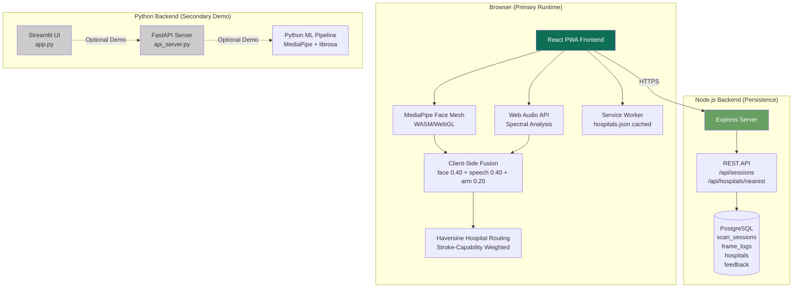
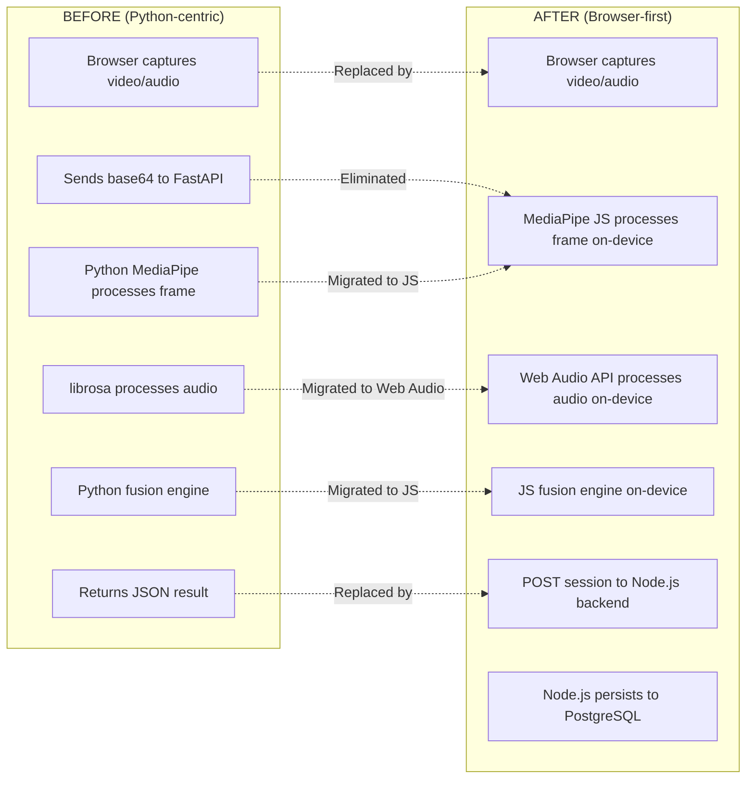
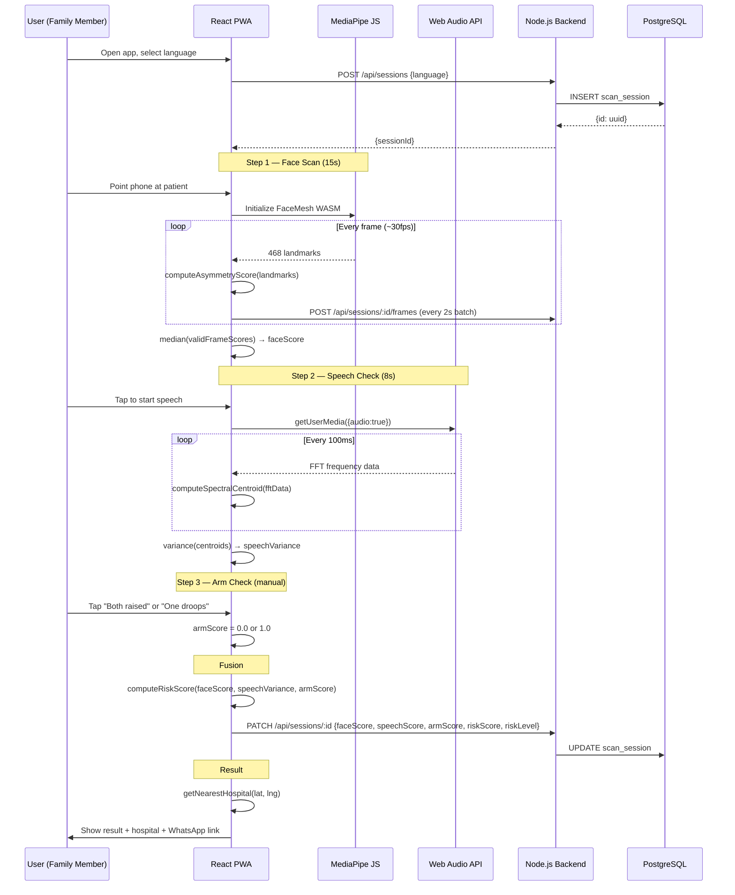

# Design Document: ML Pipeline Migration


## Overview

This design document describes the migration of the FAST Check stroke detection ML pipeline from a Python server-side architecture (MediaPipe + librosa + FastAPI) to a browser-first Progressive Web App (PWA) architecture using MediaPipe JS (WebGL/WASM) and Web Audio API. The migration enables on-device ML inference, offline capability, multilingual support, and improved accessibility for rural India use cases.

**Key Migration Goals:**
- Move facial asymmetry detection from Python MediaPipe to MediaPipe JS (WASM/WebGL) running in the browser
- Replace librosa-based audio analysis with Web Audio API spectral centroid variance
- Implement client-side weighted risk fusion (face 0.40 + speech 0.40 + arm 0.20)
- Add Haversine-based hospital routing with stroke-capability weighting
- Build PWA with offline fallback using cached hospitals.json
- Migrate Node.js backend schema from screenings/alert_events to scan_sessions/frame_logs/hospitals/feedback
- Keep Python FastAPI + Streamlit as secondary demo/dev tool (not primary runtime)

## Architecture

### High-Level System Architecture



### Migration Boundary Map



### User Flow Sequence



## Components and Interfaces

### Component 1: FaceScan (client/src/screens/FaceScan.jsx)

**Purpose**: Manages the 15-second camera session, feeds frames to MediaPipe JS, collects per-frame asymmetry scores, and produces a final median face score.

**Interface**:
```typescript
interface FaceScanProps {
  sessionId: string
  onComplete: (faceScore: number, frameLogs: FrameLog[]) => void
  onError: (reason: 'camera_denied' | 'no_face_detected' | 'insufficient_frames') => void
}

interface FrameLog {
  frameTs: number       // ms since scan start
  rawScore: number      // raw asymmetry score
  faceDetected: boolean
}
```

**Responsibilities**:
- Request camera permission via `getUserMedia({ video: { facingMode: 'user' } })`
- Initialize `@mediapipe/face_mesh` with WebGL backend
- Process frames at ~30fps, compute asymmetry score per frame
- Batch-upload frame logs to backend every 2 seconds
- Require minimum 200 valid frames before finalizing
- Use median (not mean) to reject outlier frames from head movement
- Show live visual feedback: face bounding box, current score, frame count

---

### Component 2: SpeechCheck (client/src/screens/SpeechCheck.jsx)

**Purpose**: Manages the 8-second microphone session, computes spectral centroid variance as a speech slur proxy, and produces a normalised speech score.

**Interface**:
```typescript
interface SpeechCheckProps {
  sessionId: string
  language: 'en' | 'hi' | 'ta' | 'te'
  speechBaseline: number | null   // from localStorage, null on first run
  onComplete: (speechScore: number, rawVariance: number) => void
  onError: (reason: 'mic_denied' | 'no_audio') => void
  onManualFallback: () => void    // user rates 1-5 manually
}
```

**Responsibilities**:
- Display language-appropriate speech prompt sentence
- Request microphone via `getUserMedia({ audio: true })`
- Create `AnalyserNode` with `fftSize = 2048`
- Sample spectral centroid every 100ms for 8 seconds
- Compute variance of centroid array
- Normalise against stored baseline (or use default thresholds on first run)
- Handle mic denied gracefully with manual 1–5 clarity rating fallback

---

### Component 3: ArmCheck (client/src/screens/ArmCheck.jsx)

**Purpose**: Presents a binary manual confirmation for arm weakness.

**Interface**:
```typescript
interface ArmCheckProps {
  onComplete: (armScore: 0.0 | 1.0) => void
}
```

**Responsibilities**:
- Show illustrated instructions in selected language
- Present two large tap targets: "Both raised equally" (→ 0.0) and "One arm droops" (→ 1.0)
- No timer — wait for explicit user tap

---

### Component 4: asymmetry.js (client/src/lib/asymmetry.js)

**Purpose**: Pure function library for computing facial asymmetry score from MediaPipe landmark arrays.

**Interface**:
```typescript
const LANDMARK_PAIRS: [number, number][] = [
  [33, 263],  // outer eye corners
  [159, 386], // upper eyelid peak
  [145, 374], // lower eyelid valley
  [61, 291],  // mouth corners
  [70, 300],  // eyebrow outer end
  [105, 334], // eyebrow inner end
  [117, 346], // cheek reference
]

function getAsymmetryScore(landmarks: NormalizedLandmark[]): number
// Returns raw score in range [0.005, 0.04+]
// Normal: 0.005–0.012, Stroke indicator: > 0.028

function normaliseAsymmetryScore(rawScore: number): number
// Returns clamped 0–1 value
// Formula: clamp((rawScore - 0.005) / 0.035, 0, 1)
```

---

### Component 5: speech.js (client/src/lib/speech.js)

**Purpose**: Web Audio API wrapper for spectral centroid variance computation.

**Interface**:
```typescript
function getSpeechScore(durationMs?: number): Promise<number>
// Returns raw spectral centroid variance
// Low variance = slurred/flat speech (high risk)
// High variance = clear dynamic articulation (low risk)

function normaliseSpeechScore(variance: number, baseline: number): number
// Returns clamped 0–1 risk score
// Formula: clamp(1 - (variance / baseline), 0, 1)
// Higher return value = higher speech risk
```

---

### Component 6: fusion.js (client/src/lib/fusion.js)

**Purpose**: Weighted risk score fusion from three normalised signals.

**Interface**:
```typescript
type RiskLevel = 'FLAG' | 'WARN' | 'CLEAR'

interface RiskResult {
  level: RiskLevel
  score: number        // 0.0–1.0
  faceNorm: number
  speechNorm: number
  armNorm: number
}

function computeRiskScore(
  faceRaw: number,
  speechVariance: number,
  armBinary: 0 | 1,
  speechBaseline?: number
): RiskResult

function clamp(val: number, min: number, max: number): number
```

**Weights**: face 0.40 + speech 0.40 + arm 0.20
**Thresholds**: FLAG > 0.55, WARN > 0.35, CLEAR ≤ 0.35

---

### Component 7: routing.js (client/src/lib/routing.js)

**Purpose**: Haversine-based hospital routing with stroke-capability penalty weighting.

**Interface**:
```typescript
interface Hospital {
  id: string
  name: string
  state: string
  district: string
  lat: number
  lng: number
  emergencyPhone: string
  hasThrombolysis: boolean
  hasCt: boolean
  tier: number          // 1=district HQ, 2=CHC, 3=PHC
  distance?: number     // km, computed at runtime
  sortScore?: number    // distance * capability penalty
}

function haversine(lat1: number, lng1: number, lat2: number, lng2: number): number
// Returns distance in km

async function getNearestHospital(lat: number, lng: number): Promise<Hospital[]>
// Returns top 3 hospitals sorted by stroke-capability-weighted distance
// Online: fetches from /api/hospitals/nearest
// Offline: reads cached /hospitals.json, runs Haversine locally
// Penalty: hasThrombolysis ? 1 : 4 (multiplied into sort score)
```

---

### Component 8: alert.js (client/src/lib/alert.js)

**Purpose**: Builds WhatsApp deep links and tel: links for emergency alerts.

**Interface**:
```typescript
type Language = 'en' | 'hi' | 'ta' | 'te'

function buildWhatsAppLink(
  hospital: Hospital,
  riskScore: number,
  distance: number,
  lang?: Language
): string
// Returns wa.me/?text=... URL with pre-filled multilingual message

function buildCallLink(phone: string): string
// Returns tel: link with whitespace stripped
```

---

### Component 9: api.js (client/src/lib/api.js)

**Purpose**: Typed fetch wrappers for all backend API calls. Fails silently when offline.

**Interface**:
```typescript
function createSession(language: string): Promise<{ id: string; createdAt: string }>

function updateSession(id: string, payload: SessionUpdatePayload): Promise<void>

function bulkInsertFrames(sessionId: string, frames: FrameLog[]): Promise<void>

function getNearestHospitals(lat: number, lng: number): Promise<Hospital[]>

function submitFeedback(sessionId: string, wasStroke: boolean, notes?: string): Promise<void>
```

---

### Component 10: Node.js Backend Routes

**Purpose**: Express routes for session persistence, hospital lookup, and feedback collection.

**Interface**:
```
POST   /api/sessions                  → create scan session
PATCH  /api/sessions/:id              → update with final scores
POST   /api/sessions/:id/frames       → bulk insert frame logs
GET    /api/hospitals/nearest?lat&lng → top 3 stroke-capable hospitals
POST   /api/feedback/:id              → submit ground truth feedback
```

---

## Data Models

### Model 1: ScanSession (replaces screenings + alert_events)

```sql
CREATE TABLE scan_sessions (
  id               UUID PRIMARY KEY DEFAULT gen_random_uuid(),
  created_at       TIMESTAMPTZ NOT NULL DEFAULT NOW(),
  language         TEXT NOT NULL DEFAULT 'en',
  face_score       NUMERIC(6,4),
  speech_score     NUMERIC(6,4),
  arm_score        NUMERIC(3,2),
  risk_score       NUMERIC(6,4),
  risk_level       TEXT,           -- CLEAR | WARN | FLAG
  alert_sent       BOOLEAN NOT NULL DEFAULT FALSE,
  district         TEXT,
  hospital_id      UUID REFERENCES hospitals(id)
);
```

**Validation Rules**:
- `language` must be one of: en, hi, ta, te
- `risk_level` must be one of: CLEAR, WARN, FLAG (or NULL if not yet computed)
- `face_score`, `speech_score`, `arm_score`, `risk_score` must be in [0.0, 1.0]
- `arm_score` must be exactly 0.0 or 1.0 when set

---

### Model 2: FrameLog

```sql
CREATE TABLE frame_logs (
  id             UUID PRIMARY KEY DEFAULT gen_random_uuid(),
  session_id     UUID NOT NULL REFERENCES scan_sessions(id) ON DELETE CASCADE,
  frame_ts       INTEGER NOT NULL,   -- ms since scan start
  raw_score      NUMERIC(8,6) NOT NULL,
  face_detected  BOOLEAN NOT NULL
);

CREATE INDEX idx_frame_logs_session ON frame_logs(session_id);
```

**Validation Rules**:
- `frame_ts` must be >= 0
- `raw_score` must be >= 0.0
- `session_id` must reference an existing scan_session

---

### Model 3: Hospital (replaces data/hospitals.json flat structure)

```sql
CREATE TABLE hospitals (
  id                UUID PRIMARY KEY DEFAULT gen_random_uuid(),
  name              TEXT NOT NULL,
  state             TEXT NOT NULL,
  district          TEXT NOT NULL,
  lat               NUMERIC(9,6) NOT NULL,
  lng               NUMERIC(9,6) NOT NULL,
  emergency_phone   TEXT NOT NULL,
  has_thrombolysis  BOOLEAN NOT NULL DEFAULT FALSE,
  has_ct            BOOLEAN NOT NULL DEFAULT FALSE,
  tier              INTEGER NOT NULL  -- 1=district HQ, 2=CHC, 3=PHC
);

CREATE INDEX idx_hospitals_location ON hospitals(lat, lng);
```

**Validation Rules**:
- `lat` must be in [-90, 90]
- `lng` must be in [-180, 180]
- `tier` must be 1, 2, or 3
- `emergency_phone` must be non-empty

---

### Model 4: Feedback

```sql
CREATE TABLE feedback (
  id            UUID PRIMARY KEY DEFAULT gen_random_uuid(),
  session_id    UUID NOT NULL UNIQUE REFERENCES scan_sessions(id),
  was_stroke    BOOLEAN,            -- ground truth, may be null
  submitted_at  TIMESTAMPTZ NOT NULL DEFAULT NOW(),
  notes         TEXT
);
```

**Validation Rules**:
- One feedback record per session (UNIQUE constraint on session_id)
- `was_stroke` may be NULL (user may not know outcome yet)

---

### Schema Migration Plan

```
BEFORE                          AFTER
──────────────────────────────────────────────────────
screenings                  →   scan_sessions
  id (SERIAL)               →     id (UUID)
  patient_name              →     (removed — privacy)
  location                  →     district
  scenario_label            →     (removed — dev only)
  risk_score                →     risk_score
  decision                  →     risk_level (CLEAR/WARN/FLAG)
  should_alert              →     alert_sent
  face_payload (JSONB)      →     face_score (NUMERIC)
  voice_payload (JSONB)     →     speech_score (NUMERIC)
  features_payload (JSONB)  →     (moved to frame_logs)

alert_events                →   (merged into scan_sessions)
  hospital_name             →     hospital_id (FK to hospitals)
  hospital_phone            →     (in hospitals table)
  alert_message             →     (generated client-side)

(new)                       →   frame_logs
(new)                       →   hospitals
(new)                       →   feedback
```


## Algorithmic Pseudocode

### Algorithm 1: Facial Asymmetry Scoring

```pascal
ALGORITHM computeAsymmetryScore(landmarks)
INPUT:  landmarks — array of 468 NormalizedLandmark objects {x, y, z}
OUTPUT: rawScore  — float in range [0.0, 0.1]

PRECONDITIONS:
  - landmarks.length = 468
  - All landmark coordinates are normalised to [0, 1]
  - landmarks[1] is the nose tip (centre reference)

POSTCONDITIONS:
  - rawScore >= 0.0
  - Normal face: rawScore in [0.005, 0.012]
  - Stroke indicator: rawScore > 0.028

BEGIN
  CONSTANT PAIRS ← [
    [33,263], [159,386], [145,374],
    [61,291], [70,300], [105,334], [117,346]
  ]
  
  nose ← landmarks[1]
  scores ← empty array
  
  FOR each [leftIdx, rightIdx] IN PAIRS DO
    left  ← landmarks[leftIdx]
    right ← landmarks[rightIdx]
    
    // Mirror left point across nose x-axis
    mirroredLx ← 2 * nose.x - left.x
    
    // Euclidean distance between mirrored left and actual right
    dx ← mirroredLx - right.x
    dy ← left.y - right.y
    pairScore ← sqrt(dx * dx + dy * dy)
    
    scores.append(pairScore)
  END FOR
  
  rawScore ← sum(scores) / length(scores)
  RETURN rawScore
END

LOOP INVARIANT (over 15-second window):
  - All appended scores are non-negative
  - scores.length increases by 1 per valid frame
```

**Preconditions**: landmarks array has exactly 468 entries; nose tip at index 1 is reliable.
**Postconditions**: Returns mean Euclidean asymmetry across 7 anatomical landmark pairs.
**Loop Invariant**: Each iteration appends exactly one non-negative score; array grows monotonically.

---

### Algorithm 2: Temporal Frame Aggregation

```pascal
ALGORITHM aggregateFrameScores(frameScores, minValidFrames)
INPUT:  frameScores    — array of {rawScore: float, faceDetected: bool}
        minValidFrames — minimum valid frames required (default: 200)
OUTPUT: finalScore     — float, or null if insufficient data

PRECONDITIONS:
  - frameScores is non-empty
  - minValidFrames > 0

POSTCONDITIONS:
  - If count(faceDetected=true) < minValidFrames: RETURN null
  - Otherwise: RETURN median of valid rawScores

BEGIN
  validScores ← [s.rawScore FOR s IN frameScores WHERE s.faceDetected = true]
  
  IF length(validScores) < minValidFrames THEN
    RETURN null   // insufficient data — prompt user to retry
  END IF
  
  // Use median to reject outlier frames from head movement
  sorted ← sort(validScores)
  mid    ← floor(length(sorted) / 2)
  
  IF length(sorted) MOD 2 = 0 THEN
    RETURN (sorted[mid - 1] + sorted[mid]) / 2
  ELSE
    RETURN sorted[mid]
  END IF
END

LOOP INVARIANT:
  - validScores contains only scores where faceDetected = true
  - All elements of validScores are non-negative floats
```

---

### Algorithm 3: Spectral Centroid Variance (Speech Slur Detection)

```pascal
ALGORITHM computeSpectralCentroid(fftData, sampleRate, fftSize)
INPUT:  fftData    — Float32Array of dB values (length = fftSize/2)
        sampleRate — audio context sample rate (e.g. 44100)
        fftSize    — analyser FFT size (e.g. 2048)
OUTPUT: centroid   — float (Hz), weighted mean frequency

PRECONDITIONS:
  - fftData.length = fftSize / 2
  - sampleRate > 0
  - fftSize > 0

POSTCONDITIONS:
  - centroid >= 0
  - centroid represents the spectral centre of mass in Hz

BEGIN
  weightedSum  ← 0
  totalWeight  ← 0
  
  FOR i FROM 0 TO fftData.length - 1 DO
    linear ← pow(10, fftData[i] / 20)   // dB to linear amplitude
    freq   ← (i * sampleRate) / fftSize  // bin centre frequency in Hz
    
    weightedSum ← weightedSum + (freq * linear)
    totalWeight ← totalWeight + linear
  END FOR
  
  IF totalWeight = 0 THEN
    RETURN 0
  END IF
  
  RETURN weightedSum / totalWeight
END

LOOP INVARIANT:
  - totalWeight accumulates non-negative linear amplitudes
  - weightedSum accumulates freq-weighted amplitudes
  - Both increase monotonically (all linear values >= 0)

ALGORITHM getSpeechVariance(durationMs)
INPUT:  durationMs — recording duration in ms (default: 8000)
OUTPUT: variance   — float, variance of centroid samples

BEGIN
  centroids ← empty array
  
  // Sample centroid every 100ms → ~80 samples for 8s
  WHILE elapsed < durationMs DO
    fftData  ← analyser.getFloatFrequencyData()
    centroid ← computeSpectralCentroid(fftData, sampleRate, fftSize)
    centroids.append(centroid)
    WAIT 100ms
  END WHILE
  
  mean     ← sum(centroids) / length(centroids)
  variance ← sum((c - mean)^2 FOR c IN centroids) / length(centroids)
  
  RETURN variance
END

LOOP INVARIANT:
  - centroids.length increases by 1 every 100ms
  - All centroid values are non-negative
```

---

### Algorithm 4: Risk Score Fusion

```pascal
ALGORITHM computeRiskScore(faceRaw, speechVariance, armBinary, speechBaseline)
INPUT:  faceRaw         — raw asymmetry score from MediaPipe (float)
        speechVariance  — spectral centroid variance (float)
        armBinary       — 0.0 (both raised) or 1.0 (one droops)
        speechBaseline  — baseline variance from healthy speech (float, default: 500000)
OUTPUT: result          — {level: 'FLAG'|'WARN'|'CLEAR', score: float, faceNorm, speechNorm, armNorm}

PRECONDITIONS:
  - faceRaw >= 0.0
  - speechVariance >= 0.0
  - armBinary IN {0.0, 1.0}
  - speechBaseline > 0

POSTCONDITIONS:
  - result.score IN [0.0, 1.0]
  - result.level = 'FLAG'  IF result.score > 0.55
  - result.level = 'WARN'  IF result.score IN (0.35, 0.55]
  - result.level = 'CLEAR' IF result.score <= 0.35
  - result.faceNorm, result.speechNorm, result.armNorm all IN [0.0, 1.0]

BEGIN
  // Normalise face: 0.005 is baseline, 0.04 is severe
  faceNorm   ← clamp((faceRaw - 0.005) / 0.035, 0.0, 1.0)
  
  // Normalise speech: lower variance = higher risk, so invert
  speechNorm ← clamp(1.0 - (speechVariance / speechBaseline), 0.0, 1.0)
  
  // Arm is already binary 0 or 1
  armNorm    ← armBinary
  
  // Weighted fusion
  score ← (faceNorm * 0.40) + (speechNorm * 0.40) + (armNorm * 0.20)
  
  IF score > 0.55 THEN
    level ← 'FLAG'
  ELSE IF score > 0.35 THEN
    level ← 'WARN'
  ELSE
    level ← 'CLEAR'
  END IF
  
  RETURN {level, score, faceNorm, speechNorm, armNorm}
END

FUNCTION clamp(val, min, max)
  RETURN max(min, min(max, val))
END
```

---

### Algorithm 5: Haversine Hospital Routing

```pascal
ALGORITHM haversine(lat1, lng1, lat2, lng2)
INPUT:  lat1, lng1 — origin coordinates (degrees)
        lat2, lng2 — destination coordinates (degrees)
OUTPUT: distance   — float (km)

PRECONDITIONS:
  - lat1, lat2 IN [-90, 90]
  - lng1, lng2 IN [-180, 180]

POSTCONDITIONS:
  - distance >= 0
  - distance <= 20015 (half Earth circumference)

BEGIN
  R    ← 6371  // Earth radius in km
  dLat ← (lat2 - lat1) * PI / 180
  dLng ← (lng2 - lng1) * PI / 180
  
  a ← sin(dLat/2)^2
      + cos(lat1 * PI/180) * cos(lat2 * PI/180) * sin(dLng/2)^2
  
  RETURN R * 2 * atan2(sqrt(a), sqrt(1 - a))
END

ALGORITHM getNearestHospitals(userLat, userLng, hospitals)
INPUT:  userLat, userLng — user GPS coordinates
        hospitals        — array of Hospital objects
OUTPUT: top3             — array of up to 3 Hospital objects, sorted by sortScore

PRECONDITIONS:
  - hospitals is non-empty
  - All hospitals have valid lat, lng, hasThrombolysis fields

POSTCONDITIONS:
  - top3.length <= 3
  - top3 is sorted ascending by sortScore
  - Hospitals with hasThrombolysis=true are ranked higher (lower sortScore)

BEGIN
  scored ← empty array
  
  FOR each hospital IN hospitals DO
    dist      ← haversine(userLat, userLng, hospital.lat, hospital.lng)
    penalty   ← IF hospital.hasThrombolysis THEN 1 ELSE 4
    sortScore ← dist * penalty
    
    scored.append({...hospital, distance: dist, sortScore: sortScore})
  END FOR
  
  sorted ← sort(scored) BY sortScore ASCENDING
  RETURN sorted[0..2]  // top 3
END

LOOP INVARIANT:
  - scored.length increases by 1 per iteration
  - All sortScore values are positive
```

---

### Algorithm 6: Morning Wellness Baseline (Exponential Moving Average)

```pascal
ALGORITHM updateBaseline(oldBaseline, oldStdDev, todayScore)
INPUT:  oldBaseline — stored median from previous days
        oldStdDev   — stored standard deviation
        todayScore  — today's raw asymmetry score
OUTPUT: {newBaseline, newStdDev, isAnomaly}

PRECONDITIONS:
  - oldBaseline > 0
  - oldStdDev >= 0
  - todayScore >= 0

POSTCONDITIONS:
  - newBaseline drifts toward todayScore at 5% per day
  - Baseline does NOT drift toward anomalous values (zScore > 2.5)
  - isAnomaly = true IF zScore > 2.5

BEGIN
  zScore ← (todayScore - oldBaseline) / max(oldStdDev, 0.001)
  
  IF zScore > 2.5 THEN
    // Significant deviation — do not drift baseline toward anomaly
    RETURN {newBaseline: oldBaseline, newStdDev: oldStdDev, isAnomaly: true}
  END IF
  
  // Exponential moving average — 5% drift per day
  newBaseline ← 0.95 * oldBaseline + 0.05 * todayScore
  newStdDev   ← 0.95 * oldStdDev + 0.05 * abs(todayScore - newBaseline)
  
  RETURN {newBaseline, newStdDev, isAnomaly: false}
END
```


## Key Functions with Formal Specifications

### getAsymmetryScore(landmarks)

```javascript
/**
 * Computes facial asymmetry score from MediaPipe Face Mesh landmarks.
 *
 * @param {NormalizedLandmark[]} landmarks - Array of 468 landmarks from MediaPipe
 * @returns {number} Raw asymmetry score (normal: 0.005–0.012, stroke: >0.028)
 *
 * Preconditions:
 *   - landmarks.length === 468
 *   - landmarks[1] is the nose tip
 *   - All x, y values are normalised to [0, 1]
 *
 * Postconditions:
 *   - return value >= 0
 *   - return value is the mean Euclidean distance across 7 mirrored landmark pairs
 *   - No mutation of input landmarks array
 */
function getAsymmetryScore(landmarks) { ... }
```

---

### normaliseAsymmetryScore(rawScore)

```javascript
/**
 * Normalises raw asymmetry score to [0, 1] risk range.
 *
 * @param {number} rawScore - Output of getAsymmetryScore
 * @returns {number} Normalised score in [0, 1]
 *
 * Preconditions:
 *   - rawScore >= 0
 *
 * Postconditions:
 *   - return value in [0.0, 1.0]
 *   - rawScore <= 0.005 → return 0.0
 *   - rawScore >= 0.040 → return 1.0
 *   - Monotonically increasing between bounds
 */
function normaliseAsymmetryScore(rawScore) {
  return Math.max(0, Math.min(1, (rawScore - 0.005) / 0.035))
}
```

---

### getSpeechScore(durationMs)

```javascript
/**
 * Records audio and computes spectral centroid variance as speech slur proxy.
 *
 * @param {number} durationMs - Recording duration (default: 8000)
 * @returns {Promise<number>} Raw spectral centroid variance
 *
 * Preconditions:
 *   - Microphone permission has been granted
 *   - durationMs > 0
 *
 * Postconditions:
 *   - Returns non-negative variance value
 *   - Low variance (< 100000) indicates flat/slurred speech
 *   - High variance (> 500000) indicates clear dynamic articulation
 *   - Audio stream is stopped and AudioContext is closed before resolving
 *   - No audio data is transmitted to any server
 *
 * Loop Invariant (centroid sampling loop):
 *   - centroids.length increases by 1 every 100ms
 *   - All centroid values are non-negative
 */
async function getSpeechScore(durationMs = 8000) { ... }
```

---

### computeRiskScore(faceRaw, speechVariance, armBinary, speechBaseline)

```javascript
/**
 * Fuses three normalised signals into a weighted risk score.
 *
 * @param {number} faceRaw        - Raw asymmetry score from getAsymmetryScore
 * @param {number} speechVariance - Raw variance from getSpeechScore
 * @param {0|1}    armBinary      - 0 = both raised, 1 = one droops
 * @param {number} speechBaseline - Baseline variance (default: 500000)
 * @returns {{ level: 'FLAG'|'WARN'|'CLEAR', score: number, faceNorm: number, speechNorm: number, armNorm: number }}
 *
 * Preconditions:
 *   - faceRaw >= 0
 *   - speechVariance >= 0
 *   - armBinary === 0 || armBinary === 1
 *   - speechBaseline > 0
 *
 * Postconditions:
 *   - score in [0.0, 1.0]
 *   - level === 'FLAG'  iff score > 0.55
 *   - level === 'WARN'  iff score > 0.35 && score <= 0.55
 *   - level === 'CLEAR' iff score <= 0.35
 *   - faceNorm, speechNorm, armNorm all in [0.0, 1.0]
 *   - score === faceNorm*0.40 + speechNorm*0.40 + armNorm*0.20
 */
function computeRiskScore(faceRaw, speechVariance, armBinary, speechBaseline = 500000) { ... }
```

---

### haversine(lat1, lng1, lat2, lng2)

```javascript
/**
 * Computes great-circle distance between two GPS coordinates.
 *
 * @param {number} lat1 - Origin latitude (degrees)
 * @param {number} lng1 - Origin longitude (degrees)
 * @param {number} lat2 - Destination latitude (degrees)
 * @param {number} lng2 - Destination longitude (degrees)
 * @returns {number} Distance in kilometres
 *
 * Preconditions:
 *   - lat1, lat2 in [-90, 90]
 *   - lng1, lng2 in [-180, 180]
 *
 * Postconditions:
 *   - return value >= 0
 *   - return value <= 20015 (half Earth circumference)
 *   - haversine(a, b, a, b) === 0 (identity)
 *   - haversine(a, b, c, d) === haversine(c, d, a, b) (symmetry)
 */
function haversine(lat1, lng1, lat2, lng2) { ... }
```

---

### getNearestHospital(lat, lng)

```javascript
/**
 * Returns top 3 nearest stroke-capable hospitals.
 * Falls back to cached hospitals.json when offline.
 *
 * @param {number} lat - User latitude
 * @param {number} lng - User longitude
 * @returns {Promise<Hospital[]>} Up to 3 hospitals sorted by capability-weighted distance
 *
 * Preconditions:
 *   - lat in [-90, 90]
 *   - lng in [-180, 180]
 *   - Either network is available OR /hospitals.json is cached
 *
 * Postconditions:
 *   - Returns array of 1–3 hospitals
 *   - Sorted ascending by (distance * (hasThrombolysis ? 1 : 4))
 *   - Each hospital has: id, name, distance, emergencyPhone, hasThrombolysis, hasCt, tier
 *   - Never throws — returns empty array on total failure
 */
async function getNearestHospital(lat, lng) { ... }
```

---

### buildWhatsAppLink(hospital, riskScore, distance, lang)

```javascript
/**
 * Builds a WhatsApp deep link with pre-filled multilingual emergency message.
 *
 * @param {Hospital} hospital   - Nearest stroke-capable hospital
 * @param {number}   riskScore  - Computed risk score (0–1)
 * @param {number}   distance   - Distance to hospital in km
 * @param {Language} lang       - 'en' | 'hi' | 'ta' | 'te' (default: 'en')
 * @returns {string} wa.me/?text=... URL
 *
 * Preconditions:
 *   - hospital.name and hospital.emergencyPhone are non-empty
 *   - riskScore in [0, 1]
 *   - distance >= 0
 *
 * Postconditions:
 *   - Returns valid URL starting with 'https://wa.me/?text='
 *   - Message is URL-encoded
 *   - Falls back to English if lang is unsupported
 *   - Message includes: risk score %, hospital name, distance, emergency phone
 */
function buildWhatsAppLink(hospital, riskScore, distance, lang = 'en') { ... }
```

---

## Example Usage

### Complete Client-Side Scan Flow

```javascript
// 1. Create session
const { id: sessionId } = await createSession('hi')

// 2. Face scan — collect frames over 15 seconds
const frameLogs = []
const faceMesh = new FaceMesh({ locateFile: (f) => `/mediapipe/${f}` })
faceMesh.setOptions({ maxNumFaces: 1, refineLandmarks: true, minDetectionConfidence: 0.5 })

faceMesh.onResults((results) => {
  const ts = Date.now() - scanStartTime
  if (results.multiFaceLandmarks?.[0]) {
    const rawScore = getAsymmetryScore(results.multiFaceLandmarks[0])
    frameLogs.push({ frameTs: ts, rawScore, faceDetected: true })
  } else {
    frameLogs.push({ frameTs: ts, rawScore: 0, faceDetected: false })
  }
})

// After 15 seconds:
const faceRaw = aggregateFrameScores(frameLogs, 200)  // median of valid frames
await bulkInsertFrames(sessionId, frameLogs)

// 3. Speech check — 8 seconds
const speechVariance = await getSpeechScore(8000)

// 4. Arm check — user tap
const armBinary = userTappedDroop ? 1.0 : 0.0

// 5. Fusion
const { level, score, faceNorm, speechNorm, armNorm } = computeRiskScore(
  faceRaw,
  speechVariance,
  armBinary
)

// 6. Hospital routing
const [lat, lng] = await getUserLocation()
const hospitals = await getNearestHospital(lat, lng)
const nearest = hospitals[0]

// 7. Persist final scores
await updateSession(sessionId, {
  faceScore: faceNorm,
  speechScore: speechNorm,
  armScore: armBinary,
  riskScore: score,
  riskLevel: level,
  alertSent: level === 'FLAG',
  district: nearest.district,
  hospitalId: nearest.id,
})

// 8. Build alert links
const whatsappUrl = buildWhatsAppLink(nearest, score, nearest.distance, 'hi')
const callUrl = buildCallLink(nearest.emergencyPhone)

// 9. Navigate to result screen
navigate('/result', { state: { level, score, nearest, whatsappUrl, callUrl } })
```

---

### Backend Session Endpoints (Node.js)

```javascript
// POST /api/sessions
app.post('/api/sessions', async (req, res) => {
  const { language = 'en' } = req.body
  const result = await db.query(
    'INSERT INTO scan_sessions (language) VALUES ($1) RETURNING id, created_at',
    [language]
  )
  res.status(201).json(result.rows[0])
})

// PATCH /api/sessions/:id
app.patch('/api/sessions/:id', async (req, res) => {
  const { faceScore, speechScore, armScore, riskScore, riskLevel,
          alertSent, district, hospitalId } = req.body
  await db.query(
    `UPDATE scan_sessions SET
       face_score=$1, speech_score=$2, arm_score=$3, risk_score=$4,
       risk_level=$5, alert_sent=$6, district=$7, hospital_id=$8
     WHERE id=$9`,
    [faceScore, speechScore, armScore, riskScore, riskLevel,
     alertSent, district, hospitalId, req.params.id]
  )
  res.status(204).end()
})

// GET /api/hospitals/nearest?lat=&lng=
app.get('/api/hospitals/nearest', async (req, res) => {
  const { lat, lng } = req.query
  // Haversine computed in SQL using earthdistance extension, or in JS after fetching all
  const hospitals = await db.query('SELECT * FROM hospitals')
  const scored = hospitals.rows
    .map(h => ({
      ...h,
      distance: haversine(+lat, +lng, h.lat, h.lng),
      sortScore: haversine(+lat, +lng, h.lat, h.lng) * (h.has_thrombolysis ? 1 : 4)
    }))
    .sort((a, b) => a.sortScore - b.sortScore)
    .slice(0, 3)
  res.json(scored)
})
```


## Correctness Properties

The following properties must hold throughout the system. They are expressed as universal quantification statements and serve as the basis for property-based tests.

### P1 — Asymmetry Score Bounds
For all valid landmark arrays `L` of length 468:
- `getAsymmetryScore(L) >= 0`
- `normaliseAsymmetryScore(getAsymmetryScore(L))` is in `[0.0, 1.0]`

**Validates: Requirements 1.4, 1.8**

### P2 — Fusion Score Bounds
For all inputs `(faceRaw >= 0, speechVariance >= 0, armBinary in {0,1})`:
- `computeRiskScore(...).score` is in `[0.0, 1.0]`
- `computeRiskScore(...).faceNorm` is in `[0.0, 1.0]`
- `computeRiskScore(...).speechNorm` is in `[0.0, 1.0]`

**Validates: Requirements 4.2, 4.3**

### P3 — Fusion Level Consistency
For all valid inputs:
- `score > 0.55` implies `level === 'FLAG'`
- `score > 0.35 && score <= 0.55` implies `level === 'WARN'`
- `score <= 0.35` implies `level === 'CLEAR'`

**Validates: Requirements 4.4, 4.5, 4.6, 4.7**

### P4 — Fusion Weight Correctness
For all valid inputs:
- `score === faceNorm * 0.40 + speechNorm * 0.40 + armNorm * 0.20` (within floating-point epsilon)

**Validates: Requirements 4.1**

### P5 — Haversine Identity
For all valid coordinates `(lat, lng)`:
- `haversine(lat, lng, lat, lng) === 0`

**Validates: Requirements 5.2**

### P6 — Haversine Symmetry
For all valid coordinate pairs:
- `haversine(lat1, lng1, lat2, lng2) === haversine(lat2, lng2, lat1, lng1)` (within epsilon)

**Validates: Requirements 5.3**

### P7 — Hospital Routing Monotonicity
For all hospital arrays with at least one `hasThrombolysis=true` hospital:
- The first result in `getNearestHospital` output has a lower or equal `sortScore` than all subsequent results

**Validates: Requirements 5.6, 5.7**

### P8 — Thrombolysis Preference
For two hospitals at equal distance where one has `hasThrombolysis=true` and the other `false`:
- The thrombolysis-capable hospital always ranks first (sortScore ratio = 1:4)

**Validates: Requirements 5.4, 5.5**

### P9 — Temporal Aggregation Null Safety
For any `frameScores` array where all entries have `faceDetected=false`:
- `aggregateFrameScores(frameScores, 200)` returns `null`

**Validates: Requirements 3.3, 10.5**

### P10 — Baseline Anomaly Guard
For any `todayScore` where `(todayScore - baseline) / stdDev > 2.5`:
- `updateBaseline(baseline, stdDev, todayScore).newBaseline === baseline` (no drift toward anomaly)

**Validates: Requirements 12.2**

### P11 — Speech Normalisation Inversion
For `speechVariance >= speechBaseline`:
- `normaliseSpeechScore(speechVariance, speechBaseline) === 0.0` (no risk from high-variance speech)

For `speechVariance === 0`:
- `normaliseSpeechScore(0, speechBaseline) === 1.0` (maximum risk from zero-variance speech)

**Validates: Requirements 2.5, 2.6**

---

## Error Handling

### Error Scenario 1: Camera Permission Denied

**Condition**: `getUserMedia({ video: true })` throws `NotAllowedError`
**Response**: Show "Camera access needed" screen with instructions to enable in browser settings
**Recovery**: Offer "Skip face check" option — face score defaults to 0.5 (neutral), confidence flagged as low
**Backend**: Session is still created; `face_score` stored as NULL

---

### Error Scenario 2: Microphone Permission Denied

**Condition**: `getUserMedia({ audio: true })` throws `NotAllowedError`
**Response**: Show manual 1–5 speech clarity rating UI
**Recovery**: Map rating to speech score: 1→1.0, 2→0.75, 3→0.5, 4→0.25, 5→0.0
**Backend**: `speech_score` stored with manual flag in session notes

---

### Error Scenario 3: Insufficient Face Frames (< 200 valid)

**Condition**: `aggregateFrameScores` returns `null` after 15 seconds
**Response**: Show "Face not clearly visible" prompt with positioning guide
**Recovery**: Offer retry (re-run face scan) or skip (face score = 0.5)
**Backend**: Frame logs still uploaded; session continues

---

### Error Scenario 4: MediaPipe WASM Load Failure

**Condition**: `@mediapipe/face_mesh` fails to initialise (network error, WASM not supported)
**Response**: Show "Face detection unavailable on this device" message
**Recovery**: Skip face check entirely; face score = 0.5 (neutral); proceed to speech check
**Backend**: Session created with `face_score = NULL`

---

### Error Scenario 5: GPS Unavailable

**Condition**: `navigator.geolocation.getCurrentPosition` fails or times out
**Response**: Show district/city text input for manual location entry
**Recovery**: Use text-based hospital lookup (district name match) instead of Haversine
**Backend**: `district` stored as text; `hospital_id` may be NULL

---

### Error Scenario 6: Backend API Unreachable (Offline)

**Condition**: All fetch calls to Node.js backend fail
**Response**: Silent failure — no user-visible error for session logging
**Recovery**: 
  - Hospital routing falls back to cached `/hospitals.json` + client-side Haversine
  - Session data queued in `localStorage` for retry on reconnect
  - WhatsApp deep link still works (system-level, not app-level)
**Backend**: Session logged on reconnect via retry queue

---

### Error Scenario 7: No Hospitals in Cache

**Condition**: Both API and `/hospitals.json` are unavailable
**Response**: Show generic emergency number (108 in India)
**Recovery**: Display "Call 108 immediately" with `tel:108` link
**Backend**: `hospital_id` stored as NULL

---

## Testing Strategy

### Unit Testing Approach

Test each pure function in `client/src/lib/` in isolation with deterministic inputs.

**Key unit test cases**:
- `getAsymmetryScore`: symmetric landmarks → score near 0; maximally asymmetric → score near 0.1
- `normaliseAsymmetryScore`: boundary values (0.005 → 0.0, 0.040 → 1.0, 0.0225 → ~0.5)
- `computeRiskScore`: all-zero inputs → CLEAR; all-max inputs → FLAG; weight verification
- `haversine`: same point → 0; Chennai to Mumbai → ~1340km (known value)
- `buildWhatsAppLink`: output starts with `https://wa.me/?text=`; all 4 languages produce non-empty messages
- `aggregateFrameScores`: all invalid frames → null; exactly 200 valid → returns median

### Property-Based Testing Approach

**Property Test Library**: fast-check (JavaScript)

```javascript
// P2: Fusion score always in [0, 1]
fc.assert(fc.property(
  fc.float({ min: 0, max: 0.2 }),   // faceRaw
  fc.float({ min: 0, max: 2000000 }), // speechVariance
  fc.constantFrom(0, 1),             // armBinary
  (faceRaw, speechVariance, armBinary) => {
    const { score } = computeRiskScore(faceRaw, speechVariance, armBinary)
    return score >= 0 && score <= 1
  }
))

// P6: Haversine symmetry
fc.assert(fc.property(
  fc.float({ min: -90, max: 90 }),
  fc.float({ min: -180, max: 180 }),
  fc.float({ min: -90, max: 90 }),
  fc.float({ min: -180, max: 180 }),
  (lat1, lng1, lat2, lng2) => {
    return Math.abs(haversine(lat1, lng1, lat2, lng2) - haversine(lat2, lng2, lat1, lng1)) < 0.001
  }
))

// P8: Thrombolysis preference
fc.assert(fc.property(
  fc.float({ min: -90, max: 90 }),
  fc.float({ min: -180, max: 180 }),
  fc.float({ min: 0, max: 1 }),  // offset for second hospital
  (lat, lng, offset) => {
    const hospitals = [
      { lat: lat + offset, lng, hasThrombolysis: false, hasCt: true, tier: 1 },
      { lat: lat + offset, lng, hasThrombolysis: true,  hasCt: true, tier: 1 },
    ]
    const result = sortHospitals(lat, lng, hospitals)
    return result[0].hasThrombolysis === true
  }
))
```

### Integration Testing Approach

- End-to-end session flow: create session → update scores → verify DB state
- Hospital routing: seed 5 hospitals with known coordinates → verify top-3 order
- Frame log bulk insert: insert 450 frames → verify count in DB
- Offline fallback: mock API failure → verify hospitals.json is used
- Schema migration: run migration script → verify old screenings data is preserved

---

## Performance Considerations

### MediaPipe JS Frame Processing
- Target: 30fps on mid-range Android (Snapdragon 665+)
- MediaPipe Face Mesh WASM binary: ~4MB — cache on first load via service worker
- Use `requestAnimationFrame` loop, not `setInterval`, for frame capture
- Downscale video to 640×480 before passing to MediaPipe to reduce GPU load
- If device GPU is unavailable, MediaPipe falls back to CPU WASM (slower, ~10fps acceptable)

### Web Audio API
- `fftSize = 2048` gives 1024 frequency bins — sufficient for speech analysis
- Sample every 100ms (10 samples/second) for 8 seconds = 80 centroid values
- Variance computation is O(n) — negligible cost

### Hospital Routing
- Client-side Haversine over ~800 hospitals: O(n) — completes in < 5ms
- Backend query: add `lat, lng` index on hospitals table for future spatial queries
- Cache hospitals.json in service worker on first load (~50KB for 800 hospitals)

### Session Persistence
- Frame logs bulk-inserted every 2 seconds (not per-frame) to reduce API calls
- Session update is a single PATCH — no polling
- All API calls fail silently offline; retry queue uses `localStorage`

---

## Security Considerations

### Privacy by Design
- No video or audio data is ever transmitted to any server
- Only computed scores (floats) are sent to the backend
- No patient name is stored (removed from schema vs. old `screenings.patient_name`)
- `district` is the coarsest location granularity stored

### Input Validation (Backend)
- `language` must be one of: en, hi, ta, te
- `risk_level` must be one of: CLEAR, WARN, FLAG
- All score fields must be in [0.0, 1.0] — reject out-of-range values with 400
- `hospitalId` must be a valid UUID referencing an existing hospital
- Frame log `frameTs` must be non-negative integer

### HTTPS Requirement
- `getUserMedia` (camera + mic) requires HTTPS — enforced by Vercel deployment
- Service worker registration requires HTTPS

### Rate Limiting
- Add rate limiting middleware on `/api/sessions` (POST) — max 10 sessions/IP/hour
- Prevents abuse of session creation endpoint

### CORS
- Backend CORS should be restricted to the Vercel frontend domain in production
- Current `cors()` with no options allows all origins — tighten before production

---

## Dependencies

### Frontend (client/)
| Package | Version | Purpose |
|---|---|---|
| react | ^18.3.0 | UI framework |
| react-dom | ^18.3.0 | DOM rendering |
| react-router-dom | ^6.x | Screen navigation |
| @mediapipe/face_mesh | ^0.4.1633559619 | On-device face landmark detection |
| vite | ^5.x | Build tool |
| vite-plugin-pwa | ^0.20.x | Service worker + manifest generation |
| tailwindcss | ^3.x | Utility-first CSS |

### Backend (server/ — replaces backend/)
| Package | Version | Purpose |
|---|---|---|
| express | ^4.21.2 | HTTP server |
| pg | ^8.13.1 | PostgreSQL client |
| cors | ^2.8.5 | CORS middleware |
| dotenv | ^16.4.5 | Environment config |
| express-rate-limit | ^7.x | Rate limiting |

**Note**: Prisma ORM is specified in the technical doc but the existing backend uses raw `pg` queries. The design supports either approach — Prisma adds type safety and migration tooling; raw `pg` avoids an additional dependency. The schema SQL above is compatible with both.

### Python (kept as secondary demo tool — no new dependencies)
| Package | Purpose |
|---|---|
| fastapi | Demo API server |
| mediapipe | Python face mesh (demo only) |
| librosa | Audio analysis (demo only) |
| streamlit | Demo UI |

### Infrastructure
| Service | Purpose |
|---|---|
| Vercel | Frontend hosting (auto HTTPS, CDN, required for getUserMedia) |
| Railway | Node.js backend + PostgreSQL |
| OpenStreetMap Nominatim | Geocoding missing hospital coordinates (one-time data pipeline) |

---

## File Structure (Target)

```
fast-check/
├── client/                          ← NEW: React PWA (primary runtime)
│   ├── public/
│   │   ├── hospitals.json           ← static offline fallback (migrated from data/)
│   │   ├── manifest.json
│   │   └── mediapipe/               ← WASM binaries cached here
│   ├── src/
│   │   ├── App.jsx
│   │   ├── main.jsx
│   │   ├── screens/
│   │   │   ├── Home.jsx
│   │   │   ├── FaceScan.jsx         ← MediaPipe JS integration
│   │   │   ├── SpeechCheck.jsx      ← Web Audio API integration
│   │   │   ├── ArmCheck.jsx
│   │   │   ├── Result.jsx
│   │   │   ├── AllClear.jsx
│   │   │   └── WellnessCheckin.jsx
│   │   ├── lib/
│   │   │   ├── asymmetry.js         ← MIGRATED from vision/asymmetry.py
│   │   │   ├── speech.js            ← MIGRATED from audio/slur_features.py
│   │   │   ├── fusion.js            ← MIGRATED from fusion/risk_fusion.py
│   │   │   ├── routing.js           ← MIGRATED from services/hospital_locator.py
│   │   │   ├── alert.js             ← MIGRATED from alerts/emergency.py
│   │   │   ├── baseline.js          ← NEW: morning wellness baseline
│   │   │   └── api.js               ← NEW: fetch wrappers for Node.js backend
│   │   └── data/
│   │       └── sentences.js         ← NEW: speech prompts in 4 languages
│   ├── vite.config.js
│   └── package.json
│
├── server/                          ← MIGRATED from backend/ (schema updated)
│   ├── src/
│   │   ├── index.js
│   │   ├── routes/
│   │   │   ├── sessions.js          ← REPLACES screeningRoutes.js
│   │   │   ├── hospitals.js         ← REPLACES hospitalRoutes.js (adds Haversine)
│   │   │   └── feedback.js          ← NEW
│   │   └── middleware/
│   │       ├── cors.js
│   │       └── ratelimit.js
│   ├── sql/
│   │   ├── schema.sql               ← REPLACES backend/sql/schema.sql
│   │   └── migrate.sql              ← NEW: migration from screenings → scan_sessions
│   └── package.json
│
├── src/stroke_detector/             ← KEPT as secondary demo tool (no changes)
├── api_server.py                    ← KEPT as secondary demo tool
├── app.py                           ← KEPT as secondary demo tool
└── data/
    └── hospitals.json               ← KEPT (also copied to client/public/)
```

